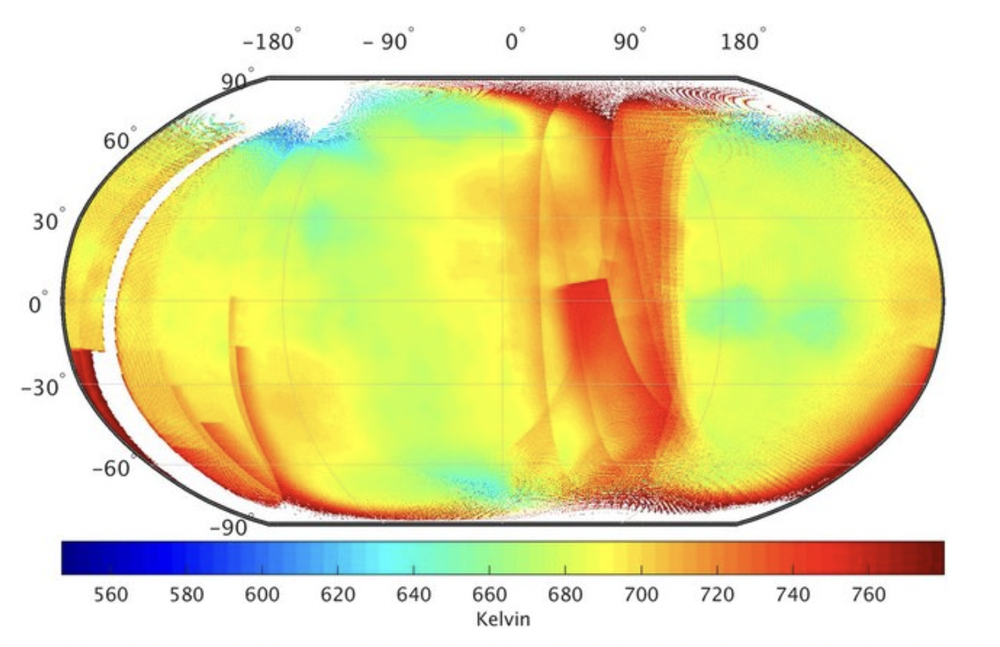

(ebm_header)=
# Simplified Energy Balance Model 

In this exercise we will develop a simple zero-dimensional energy balance model
for the Earth. With this conceptual model we will look at complex interactions
in the atmosphere with simplified processes. We will show how simple model can
help to derive important insights into the Earth system and how
sensitivity simulations provide a deeper understanding of the observed climate
variability.

### Learning objectives:
* Equilibrium states in the Earth system
* Greenhouse effect
* Develop a simple conceptual model
* Integrate a model in time 
* How to set up sensitivity runs

### After the exercise you should be able to answer the following questions:
* Why can we run climate simulations for many decades even though our predictability of weather events is very limited?
* With this model we will perform sensitivity simulations that will show us important processes in the atmosphere.

### Preliminary considerations: The global energy budget
```{figure} ./pics/GlobalEnergyBudget.png
:height: 600px
:name: globalEnergyBudget

Observed global energy flows (Trenberth and Fasullo (2012).
```
Assume that the Earth behaves like a blackbody radiator with effective global mean surface
**emission temperature** $T_s$. Use the Stefan-Boltzmann law to calculate the
emission temperature using the observed **outgoing longwave radiation** (OLR) (see
{numref}`globalEnergyBudget`)

$$
OLR = \sigma T_s^4
$$

with $\sigma=5.67\cdot10^{-8}$ the Stefan=Boltzmann constant. 
Compare the value with the mean global surface
temperature of the earth? Does the model assumption that the Earth is a
blackbody radiator seem justified?

> **Task 1:** Write a Python function for the OLR and effective temperature for later use. 

The emission into space is reduced due to the greenhouse effect. We make a
simplified assumption that only part of the radiation is emitted into space
and part of the energy remains in the system. 

> **Task 2:** Extend the OLR function by
another **transmissivity** constant $\tau$ which takes this effect into
account. Determine the transmissivity for a global mean temperature of 288 K.

> **Task 3:** Determine the planetary albedo from the observations
> ({numref}`globalEnergyBudget`) and write a function for the absorbed
> shortwave radiation, the part of the incoming sunlight that is not reflected
> back to space.

> **Task 4:**  What additional amount of energy would have to remain in the system for the
global temperature to rise by 4 K?

Before we turn to a time-dependent energy balance model, we want to deal with
the concept of **equilibrium temperature**. It is based on the fundamental
assumption that the energy balance in the Earth system is balanced, i.e. 

$$
ASR=OLR
$$

This condition can only be fulfilled if there is a corresponding equilibrium
temperature that ensures that the OLR balances the short-wave radiation
balance. This equation is given as follows

$$
(1-\alpha) \cdot Q = \tau \sigma T_s^4.
$$

> **Task 5:** Rearrange the equation according to the temperature denoting our
equilibrium temperature. Substitute the observed values for insolation,
transmissivity and planetary albedo and calculate the equlibrium temperature.

> **Task 6:** Suppose that, due to a changing climate the atmos

### Simple Energy Balance Model: Problem description
```{figure} ./pics/ebm_01.png
:height: 300px
:name: ebm_sketch


Assume that cloud cover changes due to a changing climate. What effect would
this have on the equilibrium temperature if the transmissivity decreased to
0.57 and the global albedo increased to 0.32?

Schematic of the zero-dimensional Energy Balance Model.
```

Next, we develop a time-dependent zero-dimensional model, i.e. we consider the Earth as a
sphere and calculate the global averaged and long-term equilibrium of radiation
fluxes. Furthermore, we neglect spatial variabilities. With this simple
approach, Arthenius was already able to gain good insights in the 19th century.

```{figure} ./pics/ebm_02.png
:height: 400px
:name: ebm_fluxes 

Considered energy fluxes and processes.
```

The energy balance is determined by the global radiation and the outgoing
long-wave radiation (see {numref}`ebm_fluxes`). Part of the incoming short-wave radiation is reflected at
the earth's surface. For this purpose, a global albedo is defined. According to
the Stefan-Boltzmann law, the earth's surface radiates long-wave energy. Due to
the path (transmission) through the atmosphere, part of this radiation energy
is absorbed and remains in the Earth system. We also assume that the surface of
the Earth is uniform with a constant heat capacity and a homogeneous surface
temperature. 

We can formulate the following energy balance equation

$$
\frac{dE}{dt}=\frac{C_w \cdot dT}{dt} = ASR+OLR,
$$

with $dE$ the change in energy, $C_w$ the heat capacity, $ASR$ the absorbed shortwave radiation
and $OLR$ the outgoing longwave radiation.

While the incoming short-wave radiation is given, the outgoing fluxes are parameterised with simple approaches:

$$
SW_{out}&=\alpha \cdot SW_{in} \\
LW_{out}&=\epsilon \cdot \sigma T^4 \cdot \tau 
$$

where the black body emissivity $\epsilon$ is set to a constant value of
0.95. The two other constants $\sigma=5.68\cdot 10^{-8}$ $W/(m^2 K^4)$ and $\tau$ are the Stefan-Boltzmann constant and the
transmissivity.

### Tasks
1. Determine the **planetary albedo** $\alpha$ from {numref}`GlobalEnergyBudget`. 
2. Write a Python function to calculate the **absorbed shortwave radiation** (ASR).
2. Discretise the energy balance equation. Use an explicit forward in time discretisation.
3. Write a function ebm which solves the equation.
4. Integrate the equation over a time of 1000 years. Use the following initial
   and boundary conditions: $S_0=1360 ~ W m^{-2}$, $T(0) = 273 ~ K$, $C_w = 10^8 ~ J/(m^2 \cdot K)$, $\alpha = 0.3$, $\tau
= 0.64$. Describe in your own words what you observe.
5. What happens if the intial temperature is set to 293 K ?
6. What changes do you observe with a higher $C_w$ value (e.g. $C_w=10\cdot10^8 ~ J/(m^2 \cdot K)$?
7. How does the result change when $\tau=1$?
8. What are the disadvantages of the energy balance model? How could it be improved?


```{admonition} Case study: Venus 
- Calculate the mean surface temperature on Venus. Due to its proximity to the
Sun, Venus has a very high irradiance of $S_{0}=2619 ~ Wm^{-2}$. Due to the
high cloud cover, the albedo is about 0.7. What surface temperature can be
expected? (Use the previous values for $C_w$ and $\tau$).

:::{figure-md} venus


Nightside surface temperature of Venus with spatial resolution of 0.5° × 0.5°.
Surface temperature retrievals are based on IR1 data from Akatsuki mission
between July 21, 2016 and December 7, 2016. White areas indicate either data is
absent or erroneous. High altitude regions are relatively colder than low
altitude regions (Data source:
https://darts.jaxa.jp/planet/project/akatsuki/ir1.html.en)
:::

- {numref}`venus` shows the surface temperatures of Venus derived from IR measurements.
Compare the measurements with your simulation. Is there a difference? If so,
why does this difference exist. 

```


